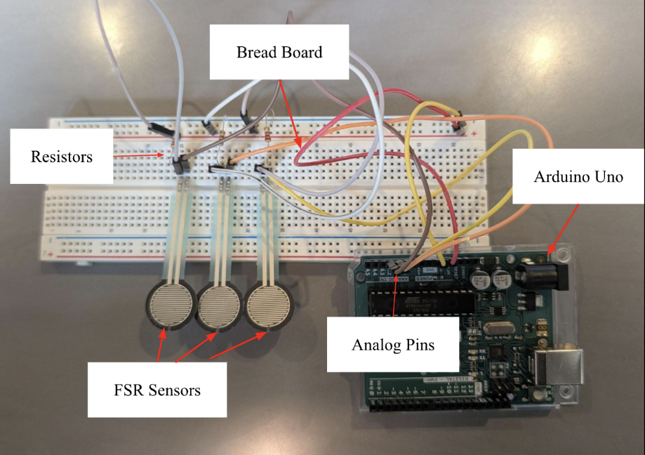
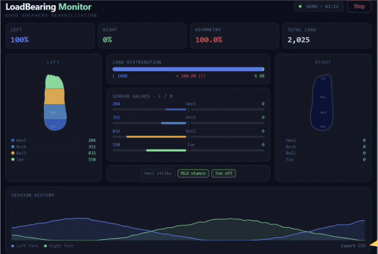

# Wearable Load-Bearing Monitor

A wearable bilateral plantar-load monitoring system designed to support lower-limb rehabilitation by measuring foot loading, providing real-time biofeedback, and displaying clinically meaningful data through a wireless web dashboard.

> **Project status:** Active development  
> **Institution:** Lehigh University  
> **Clinical sponsor:** Good Shepherd Rehabilitation  
> **Development period:** Spring–Fall 2026

---

## Project Overview

Patients recovering from lower-limb injuries and orthopedic procedures are often prescribed partial weight-bearing restrictions. Following these restrictions is clinically important because excessive loading can interfere with healing, while insufficient loading may slow rehabilitation.

Current weight-bearing assessments frequently rely on verbal instructions, patient self-reporting, and periodic observation by physical therapists. These methods provide limited objective information and do not continuously alert patients when they exceed a prescribed load.

The Wearable Load-Bearing Monitor is intended to provide a lower-cost, wearable system that:

- Measures plantar loading beneath both feet
- Estimates force applied at important anatomical regions
- Streams sensor measurements wirelessly
- Compares left and right foot loading
- Provides visual and auditory biofeedback
- Helps clinicians evaluate compliance with weight-bearing restrictions

---

## Clinical Need

The project is intended for rehabilitation patients recovering from conditions such as:

- Lower-limb fractures
- Tibial plateau fractures
- Calcaneal fractures
- Total knee arthroplasty
- Total hip arthroplasty
- Lower-limb surgery
- Other conditions requiring partial weight-bearing restrictions

The prototype is being designed for use by physical therapists, rehabilitation clinicians, and patients during supervised mobility training.

---

## System Concept

The proposed system consists of bilateral sensor-equipped insoles connected to an external electronics enclosure secured near the ankle.

```text
Plantar Force Sensors
        ↓
Analog Signal-Conditioning Circuit
        ↓
Microcontroller and ADC
        ↓
Calibration and Force Conversion
        ↓
Bluetooth Low Energy
        ↓
Clinical Web Dashboard
        ↓
Visual and Auditory Feedback
```

---

## Prototype Preview

### Three-Sensor Breadboard Prototype



This Spring 2026 breadboard prototype was used to verify that three force-sensitive resistors could be read independently through separate Arduino analog inputs. It represents the transition from initial single-sensor testing to multi-channel data acquisition.

### Clinical Dashboard Draft



This dashboard draft presents the planned interface for bilateral plantar-load visualization, regional sensor monitoring, left-versus-right comparison, load asymmetry feedback, and session data display.

---

## Work Completed — Spring 2026

During the first development phase, the team completed:

- Clinical need and stakeholder research
- Review of commercial plantar-pressure monitoring technologies
- Evaluation of force-sensitive resistor options
- Microcontroller comparison and preliminary selection
- Single-sensor breadboard testing
- Three-sensor breadboard integration
- Raw analog data acquisition with Arduino
- Initial dashboard interface development
- Concept development for the insole and ankle enclosure
- Preliminary attachment-mechanism evaluation
- Preliminary failure mode analysis

---

## Sensor Placement

The current design calls for four sensing regions per foot:

1. Posterior heel
2. Lateral midfoot
3. First metatarsal head
4. Fifth metatarsal head

These regions are intended to capture loading during heel strike, stance, weight transfer, and forefoot push-off.

Final sensor selection remains under evaluation. Candidate technologies include Interlink force-sensing resistors and Tekscan FlexiForce sensors.

---

## Current Hardware Architecture

The current prototype architecture includes:

- Four force sensors per foot
- Eight total sensor channels
- Arduino Nano ESP32
- Analog signal-conditioning or voltage-divider circuitry
- Bluetooth Low Energy communication
- Piezoelectric buzzer
- Visual indicator LED
- Rechargeable battery system
- Perfboard or future custom PCB
- 3D-printed electronics enclosure
- EVA-based insole structure
- Adjustable ankle-mounted attachment

The electronics enclosure is intended to house the microcontroller, battery, and supporting circuitry outside the primary plantar load-bearing area.

---

## Firmware Objectives

The embedded firmware is planned to:

- Sample eight sensor channels
- Maintain a minimum sampling rate of 20 Hz
- Convert raw ADC readings into force estimates
- Apply individual sensor calibration coefficients
- Calculate aggregate force for each foot
- Compare bilateral load distribution
- Transmit measurements through Bluetooth Low Energy
- Activate an LED and buzzer when a prescribed load threshold is exceeded

The target communication performance is fewer than 5% dropped packets during continuous 30-minute sessions.

---

## Web Dashboard

A browser-based dashboard has been developed to visualize measurements from the wearable system.

Current and planned features include:

- Bluetooth Low Energy connection
- Real-time plantar-load display
- Four-zone visualization for each foot
- Color-coded pressure heatmaps
- Left-versus-right load comparison
- Bilateral asymmetry indication
- Gait-phase tagging
- Session history
- CSV data export
- Clinician-configured load thresholds
- Visual overload warnings
- Demo Mode for hardware-independent testing

The dashboard is intended to operate in a compatible web browser without requiring specialized clinical software.

---

## Fall 2026 Development Plan

### T1 — Multi-Sensor Insole Hardware Fabrication

- Fabricate bilateral sensor arrays
- Integrate four sensors per foot
- Develop permanent soldered wiring
- Build EVA-based insole assemblies
- Fabricate ankle-mounted electronics enclosures
- Produce at least two complete insole pairs

### T2 — Firmware and BLE Integration

- Read all eight sensor channels
- Implement calibration coefficients
- Stream calibrated data at 20 Hz or greater
- Add LED and buzzer threshold alerts
- Validate Bluetooth communication stability

### T3 — Sensor Calibration

- Calibrate each sensor independently
- Apply known reference loads
- Fit nonlinear calibration curves
- Target an R² value of at least 0.95
- Target a coefficient of variation of 10% or less

### T4 — Prototype Validation

- Compare measured force with reference loads
- Evaluate accuracy and repeatability
- Target a mean absolute percentage error of 15% or less
- Test mechanical durability
- Test wiring and enclosure integrity

### T5 — Clinical Usability Evaluation

- Evaluate device placement and removal
- Evaluate clarity of the dashboard
- Evaluate effectiveness of visual and auditory feedback
- Collect clinician and user feedback
- Document ergonomic limitations

### T6 — Final Revision and Documentation

- Revise the physical and electronic design
- Complete the operation manual
- Complete the maintenance guide
- Document recalibration procedures
- Organize firmware, CAD, schematic, and test files
- Prepare the final prototype and presentation

---

## Engineering Requirements

| Requirement | Target |
|---|---:|
| Sensor channels | 8 total |
| Sensors per foot | 4 |
| Minimum sampling rate | ≥20 Hz |
| BLE packet loss | <5% |
| Continuous streaming test | 30 minutes |
| Calibration fit | R² ≥0.95 |
| Repeatability | CV ≤10% |
| Validation error | MAPE ≤15% |
| Total material budget | <$999 |

---

## Key Performance Metrics

The system may be used to calculate or estimate:

- Total load per foot
- Peak plantar force
- Load distribution by foot region
- Bilateral load asymmetry
- Loading rate
- Stance duration
- Swing duration
- Prescribed load-threshold compliance

---

## Repository Structure

```text
docs/          Project need, requirements, decisions, risks, and validation plans
hardware/      Schematics, breadboard designs, perfboard, PCB, and BOM
firmware/      Sensor acquisition, calibration, BLE, and alert code
dashboard/     Web dashboard source code, demo files, and screenshots
calibration/   Procedures, datasets, equations, and calibration curves
testing/       Accuracy, BLE, durability, and usability testing
mechanical/    Insole, ankle strap, and electronics enclosure files
images/        Prototype photographs, diagrams, and dashboard images
reports/       Design summaries, validation reports, and final documentation
```

---

## Current Development Status

The project is transitioning from proof-of-concept breadboard testing to:

- Individual sensor characterization
- Permanent multi-sensor circuitry
- BLE firmware integration
- Insole fabrication
- Electronics enclosure development
- Controlled calibration
- Prototype validation
- Clinical usability evaluation

---

## Design Considerations

Important design considerations include:

- Patient comfort
- Measurement accuracy
- Sensor repeatability
- Individual sensor calibration
- Adjustability across foot sizes
- Compatibility with shoes and rehabilitation boots
- Safe battery placement
- Secure wiring
- Cleaning and maintenance
- Wireless reliability
- Simple clinical interpretation
- Protection of patient information

---

## Safety and Regulatory Notice

This project is an engineering prototype developed for educational and research purposes.

It is not a certified medical device and should not be used independently for diagnosis, treatment decisions, or unsupervised clinical care. Any testing involving patients must follow institutional, clinical, ethical, and safety requirements.

The public repository should not include protected health information, patient identifiers, personal addresses, private phone numbers, or confidential sponsor information.

---

## Team

Lehigh University Interdisciplinary Capstone Design Team:

- Catherine Yazdanyar
- Jade Bond
- Regina Ruiz
- John Nathan Barnwell
- Zachary Brodbar

Clinical collaboration with Good Shepherd Rehabilitation.

---

## License

This project is currently distributed under the MIT License unless otherwise indicated.